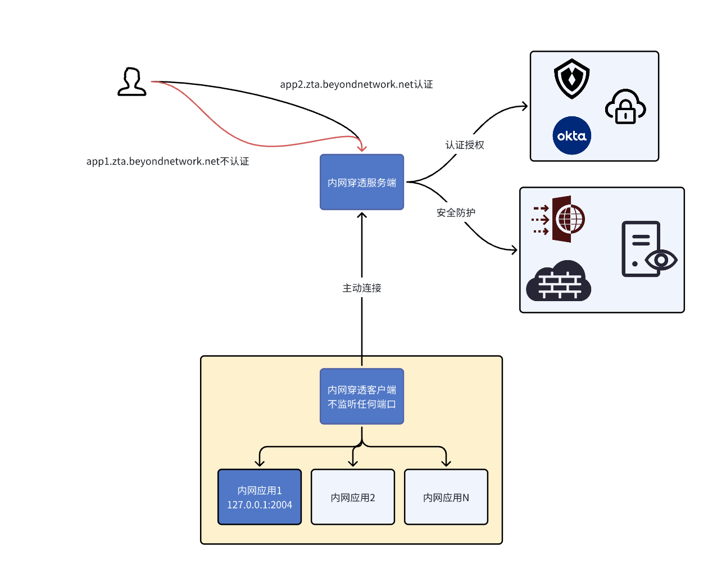

# zero trust access

正在尝试开发的一款零信任访问的项目，项目先从一个内网穿透开始做起，然后逐步加上认证功能。



如果您对项目感兴趣，可以通过B站和Youtube查看项目的演进过程。

- [B站——呼噜聊网络](https://www.bilibili.com/video/BV1hFY7ekEiC)
- [Youtube——呼噜聊网络](https://www.youtube.com/watch?v=uQLmmzyrS94&list=PLp5HQrfSZFiogfdDhlXjgxoWAIwiqqtAh)

| 里程碑   | 功能描述                          | 状态 | 参考视频                                                                                                                                                   |
|:------|:------------------------------|:---|:-------------------------------------------------------------------------------------------------------------------------------------------------------|
| MVP版本 | 完成最简单的TCP内网穿透                 | ✔  | [自己动手实现一个内网穿透3：MVP版本发布](https://www.bilibili.com/video/BV1x4YqedEQx/?share_source=copy_web&vd_source=b1d8575a4fa690d0b8f9b65d05249326)                 |
| HTTP内网穿透 | 结合Apisix实现一个内网穿透，实现复用80和443端口 | ✔  | [自己动手实现一个内网穿透5：里程碑2，接入Apisix实现HTTP内网穿透](https://www.bilibili.com/video/BV1eaegehEHj/?share_source=copy_web&vd_source=b1d8575a4fa690d0b8f9b65d05249326) |
| HTTP内网穿透+身份认证 | 基于OIDC协议实现身份认证功能，保护内网穿透的数据安全  | ✔  | [自己动手实现一个内网穿透8】里程碑3，给HTTP内网穿透加身份认证](https://www.bilibili.com/video/BV1Q8WkedEsu/?share_source=copy_web&vd_source=b1d8575a4fa690d0b8f9b65d05249326)     |
| TCP内网穿透+身份认证 | 实现原生TCP应用的身份认证功能              | ❌  |                                                                                                                                                        |
| 可视化，安全防火方面的功能 | 内容待定                          | ❌  |                                                                                                                                                        |

## 运行
### 二进制文件运行

**服务端**

- 安装apisix，参考: (apisix安装指南](https://apisix.apache.org/zh/docs/apisix/installation-guide/)

- 运行zta服务端程序
```shell
cd release

nohup ./zta-gw_linux_amd64 -c gateway.yaml &
```

**客户端**

```shell
./zta-gw_darwin_amd64 -client_id=客户端id -server_addr=服务端IP:端口
```
 
## docker方式运行（推荐）

```shell
cd docker-compose 
docker-compose up --build -d
```
 
## 配置详解

- gateway.yaml: 主配置文件

```yaml
# 服务端监听地址
gateway:
  listen_addr: ":12359"

# http路由模块配置
http_routes:
  apisix: |
    {
      "api": "http://127.0.0.1:9180",
      "key": "edd1c9f034335f136f87ad84b625c8f1"
    }
    
# 内网穿透配置
listener_file: /opt/apps/zta/etc/listener.json

# ssl证书和密钥配置
ssl_file: /opt/apps/zta/etc/ssl.json
```

- listener.json: 内网穿透配置，支持tcp，http和https
```yaml
[
  {
    # 客户端ID
    "client_id": "test-client",
    # 公网协议（tcp/http/https）
    "public_protocol": "tcp",
    # 监听ip(tcp用0.0.0.0，http，https用127.0.0.1)
    "public_ip": "0.0.0.0",
    # 监听端口，不能冲突
    "public_port": 10000,
    # 穿透内网的协议
    "internal_protocol": "tcp",
    # 穿透内网的ip
    "internal_ip": "127.0.0.1",
    # 穿透内网的端口
    "internal_port": 2000
  },
  {
    "client_id": "test-client",
    "public_protocol": "http",
    "public_ip": "127.0.0.1",
    "public_port": 10002,
    "internal_protocol": "tcp",
    "internal_ip": "127.0.0.1",
    "internal_port": 2002,
    # http路由类型，仅针对public_protocol=http或https
    "http_route_type": "apisix",
    # http路由配置参数，根据http_route_type决定，以下配置为apisix的http路由配置参数
    "http_param": { # 参考：[apisix路由api](https://apisix.apache.org/zh/docs/apisix/admin-api/#route)
      "id": "zta_localhost_10002",
      "uri": "/*",
      "hosts": [
        "hulu2.byc.net"
      ],
      "upstream": {
        "type": "roundrobin",
        "nodes": {
          "127.0.0.1:10002": 1
        }
      }
    }
  }
]
```

## 编译

- 安装golang开发环境，参考[golang.org](https://golang.org)

```shell
./build.sh
```

执行成功之后会生成一个release的目录，里面包含各个系统的服务端程序`zta-gw_$GOOS_$GOARCH`以及客户端`zta-client_$GOOS_$GOARCH`

## 构建docker镜像（可选）

```shell
./build_image.sh
```

执行成功之后会在本地构建一个ickelin/zta的镜像
